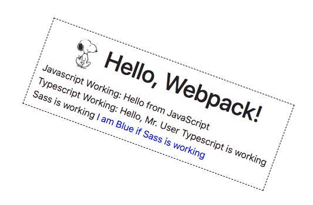

Base project using webpack for website builds.  

## Only make changes in the src directory.  All files will be generated and moved to the dist directory.  

## Steps
* Run `npm install` from the root directory of the project.
###### Linked CSS/JS
* Run `npm run start` for local development or run `npm run build` to compile and load into the dist folder. 
###### Inlined CSS/JS
* Run `npm run start-inline` for local development and inline css/js or run `npm run build-inline` to compile and load into the dist folder with css/js inline. 
## Working Set up

## Favicon syntax
`${require('./img/apple-touch-icon-32x32-precomposed.png')}` or use the favicons-webpack-plugin (https://github.com/jantimon/favicons-webpack-plugin)

## Partials syntac
`${require('./partial/heading.html')}`

**Currently, the dist folder is on gitignore.**

## Language Injection
###### Setup
* Use .ejs files instead of .html to view replacement while serving locally. Place .json inside /data directory and reference multi-page code after For copy text injection (eg. languages) comment in webpack.config.js for usage

## Project structure
root
* gruntfile.js
* package.json
* src/
  * index.html
  * index.js
  * scss/
  * img/
  * scripts/
  * typescript/
  * data/
* dist/
  * index.html
  * css/
  * js/
  * img/

     